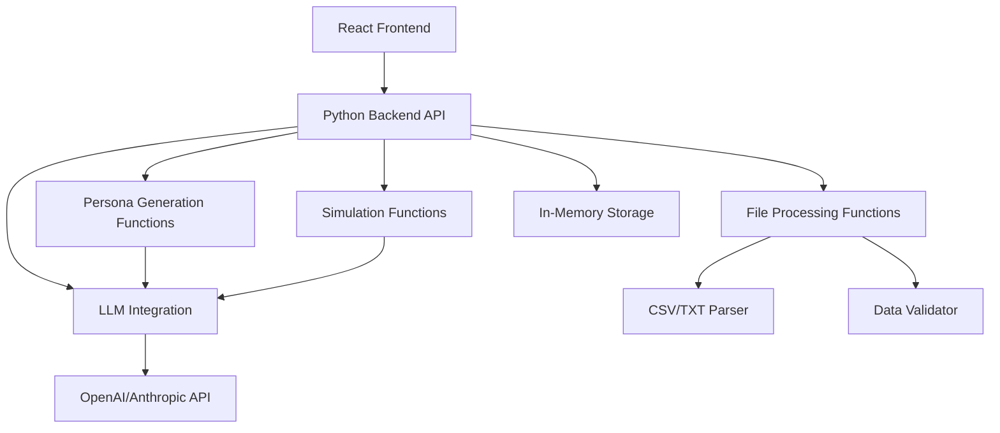

# Design Document

## Overview

The Persona Simulator is built as a full-stack application with a React TypeScript frontend and Python backend. The frontend uses modern UI components (Radix UI + Tailwind CSS) while the backend provides API endpoints for persona generation and simulation using LLM integration. This MVP focuses on core functionality with simple prompt-based persona generation.

## Architecture

### High-Level Architecture



### Technology Stack

**Frontend:**
- **Framework**: React 19 with TypeScript
- **Build Tool**: Vite
- **UI Components**: Radix UI primitives with custom styling
- **Styling**: Tailwind CSS with custom design system
- **Routing**: React Router DOM
- **State Management**: React hooks (useState, useContext)
- **HTTP Client**: Fetch API or Axios

**Backend:**
- **Runtime**: Python with uv package manager
- **Web Framework**: FastAPI
- **Data Validation**: Pydantic v2
- **LLM Integration**: OpenAI/Anthropic Python SDK
- **File Processing**: Built-in Python libraries (csv, json)
- **Data Storage**: In-memory (Python dictionaries/lists for MVP)

## Components and Interfaces

### Core Data Models

**Backend Pydantic Models:**

```python
from pydantic import BaseModel, Field
from typing import Optional, List, Literal
from datetime import datetime
from uuid import UUID, uuid4

class PersonaCharacteristics(BaseModel):
    personality: List[str]
    pain_points: List[str]
    goals: List[str]
    communication_style: Literal['formal', 'casual', 'technical', 'friendly']
    decision_making_style: Literal['analytical', 'intuitive', 'collaborative', 'decisive']
    experience: Literal['beginner', 'intermediate', 'expert']

class PersonaData(BaseModel):
    id: str = Field(default_factory=lambda: str(uuid4()))
    name: str
    role: str
    company: Optional[str] = None
    industry: Optional[str] = None
    characteristics: PersonaCharacteristics
    source_data: str  # Original list entry
    llm_prompt: str  # Generated prompt for LLM interactions
    created_at: datetime = Field(default_factory=datetime.now)
    updated_at: datetime = Field(default_factory=datetime.now)

class AudienceList(BaseModel):
    id: str = Field(default_factory=lambda: str(uuid4()))
    name: str
    description: Optional[str] = None
    personas: List[PersonaData] = []
    created_at: datetime = Field(default_factory=datetime.now)
    metadata: dict = {}

class Message(BaseModel):
    id: str = Field(default_factory=lambda: str(uuid4()))
    content: str
    role: Literal['user', 'persona']
    timestamp: datetime = Field(default_factory=datetime.now)

class SimulationSession(BaseModel):
    id: str = Field(default_factory=lambda: str(uuid4()))
    persona_id: str
    messages: List[Message] = []
    started_at: datetime = Field(default_factory=datetime.now)
    last_activity: datetime = Field(default_factory=datetime.now)
    scenario: Optional[str] = None
```

**Frontend TypeScript Interfaces:**

```typescript
// Mirror the Python models for frontend use
interface PersonaCharacteristics {
  personality: string[]
  pain_points: string[]
  goals: string[]
  communication_style: 'formal' | 'casual' | 'technical' | 'friendly'
  decision_making_style: 'analytical' | 'intuitive' | 'collaborative' | 'decisive'
  experience: 'beginner' | 'intermediate' | 'expert'
}

interface PersonaData {
  id: string
  name: string
  role: string
  company?: string
  industry?: string
  characteristics: PersonaCharacteristics
  source_data: string
  llm_prompt: string
  created_at: string
  updated_at: string
}

interface AudienceList {
  id: string
  name: string
  description?: string
  personas: PersonaData[]
  created_at: string
  metadata: Record<string, any>
}

interface Message {
  id: string
  content: string
  role: 'user' | 'persona'
  timestamp: string
}

interface SimulationSession {
  id: string
  persona_id: string
  messages: Message[]
  started_at: string
  last_activity: string
  scenario?: string
}
```

### API Layer

**Backend Function Signatures:**

```python
# File Processing Functions
async def parse_uploaded_file(file_content: bytes, filename: str) -> List[str]:
    """Parse uploaded file and return list of entries"""

def parse_text_input(text: str) -> List[str]:
    """Parse text input and return list of entries"""

def validate_list_data(entries: List[str]) -> dict:
    """Validate list entries and return validation results"""

# Persona Generation Functions
async def generate_persona_from_entry(entry: str, instructions: Optional[str] = None) -> PersonaData:
    """Generate a single persona from list entry using LLM"""

async def generate_personas_batch(entries: List[str], instructions: Optional[str] = None) -> List[PersonaData]:
    """Generate multiple personas from list entries"""

def create_persona_prompt(entry: str, characteristics: PersonaCharacteristics) -> str:
    """Create LLM prompt for persona interactions"""

# Simulation Functions
async def start_simulation_session(persona_id: str, scenario: Optional[str] = None) -> SimulationSession:
    """Start new simulation session with persona"""

async def send_message_to_persona(session_id: str, user_message: str) -> Message:
    """Send message to persona and get LLM response"""

def get_session_history(session_id: str) -> Optional[SimulationSession]:
    """Retrieve simulation session history"""

# Storage Functions (In-Memory for MVP)
def store_audience_list(audience_list: AudienceList) -> str:
    """Store audience list in memory"""

def get_audience_list(list_id: str) -> Optional[AudienceList]:
    """Retrieve audience list from memory"""

def store_simulation_session(session: SimulationSession) -> str:
    """Store simulation session in memory"""
```

**API Endpoints:**

```python
# FastAPI route definitions
@app.post("/api/lists/upload")
async def upload_list(file: UploadFile, instructions: Optional[str] = None)

@app.post("/api/lists/text")
async def create_list_from_text(text: str, instructions: Optional[str] = None)

@app.get("/api/lists/{list_id}")
async def get_audience_list(list_id: str)

@app.get("/api/personas/{persona_id}")
async def get_persona(persona_id: str)

@app.post("/api/simulations/start")
async def start_simulation(persona_id: str, scenario: Optional[str] = None)

@app.post("/api/simulations/{session_id}/message")
async def send_message(session_id: str, message: str)

@app.get("/api/simulations/{session_id}")
async def get_simulation_session(session_id: str)
```

### UI Component Structure

#### Page Components
- **ListUpload**: File upload and text input interface
- **PersonaLibrary**: Grid/list view of generated personas
- **PersonaDetail**: Individual persona profile and characteristics
- **SimulationChat**: Chat interface for persona interactions
- **SessionHistory**: View past simulation sessions
- **ExportResults**: Export and reporting interface

#### Shared Components
- **PersonaCard**: Reusable persona display component
- **FileUploader**: Drag-and-drop file upload component
- **DataTable**: Sortable/filterable table for persona lists
- **ChatMessage**: Message bubble component with markdown support
- **ExportDialog**: Modal for export options and settings

## Data Models

### Persona Generation Logic (MVP)

The system generates personas using LLM prompts for simplicity:

1. **Entry Analysis**: Basic parsing of list entry (name, company, role if available)
2. **LLM Prompt Creation**: Generate structured prompt asking LLM to create persona characteristics
3. **Response Processing**: Parse LLM response into PersonaCharacteristics structure
4. **Prompt Generation**: Create interaction prompt for future conversations with this persona

**Example LLM Prompt for Persona Generation:**
```
Based on this information: "{entry}"

Create a B2B professional persona with the following characteristics:
- Name and role (if not provided, infer reasonable ones)
- Company and industry
- 3-5 personality traits
- 3-4 main pain points in their work
- 3-4 professional goals
- Communication style (formal/casual/technical/friendly)
- Decision making style (analytical/intuitive/collaborative/decisive)
- Experience level (beginner/intermediate/expert)

Respond in JSON format matching the PersonaCharacteristics schema.
```

### Storage Strategy (MVP)

- **Backend Memory**: Python dictionaries for audience lists and simulation sessions
- **Frontend State**: React state management for UI data
- **No Persistence**: Data lost on server restart (acceptable for MVP)
- **Future**: Will migrate to proper database when scaling

## Error Handling

### File Processing Errors
- **Invalid File Format**: Display supported formats and conversion suggestions
- **File Size Limits**: Implement chunked processing for large files
- **Parsing Failures**: Provide detailed error messages with line numbers
- **Empty Results**: Guide users on data format requirements

### Persona Generation Errors
- **Insufficient Data**: Request additional information or use defaults
- **Generation Failures**: Retry with simplified parameters
- **Validation Errors**: Highlight specific issues and suggest fixes

### Simulation Errors
- **Network Issues**: Graceful degradation with offline mode
- **Response Failures**: Retry mechanisms and fallback responses
- **Session Corruption**: Auto-recovery and session restoration

### User Experience Error Handling
- **Toast Notifications**: Non-intrusive error messages
- **Inline Validation**: Real-time feedback on form inputs
- **Progress Indicators**: Clear status during long operations
- **Recovery Actions**: Always provide next steps for users

## Testing Strategy

### Unit Testing
- **Service Layer**: Test all business logic functions
- **Utility Functions**: File parsing, data validation, persona generation
- **Component Logic**: State management and event handling
- **Data Models**: Validation and transformation functions

### Integration Testing
- **File Upload Flow**: End-to-end file processing
- **Persona Generation**: Complete list-to-persona pipeline
- **Simulation Sessions**: Chat interaction workflows
- **Data Persistence**: Storage and retrieval operations

### User Experience Testing
- **Accessibility**: Screen reader compatibility, keyboard navigation
- **Responsive Design**: Cross-device functionality
- **Performance**: Large file handling, smooth interactions
- **Error Scenarios**: Graceful failure handling

### Test Data Strategy
- **Sample Files**: CSV, TXT, Excel files with various formats
- **Edge Cases**: Empty files, malformed data, special characters
- **Performance Data**: Large datasets for stress testing
- **Persona Variations**: Diverse characteristics and scenarios

### Automated Testing Tools
- **Jest**: Unit and integration testing
- **React Testing Library**: Component testing
- **Playwright**: End-to-end testing
- **Accessibility Testing**: axe-core integration